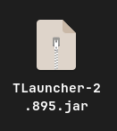

  
  <h1>Como instalar TLauncher no Arch Linux</h1>

 

  <ol type=number>
    <li>Visita esse site para instalar o TLauncher, tem que instalar da opção Linux: <a href="https://tlauncher.org/en/">TLauncher</a></li>
    <li>Vai no explorador de arquivo e extrair da pasta zip</li>
    <li>Depois de extrair, entra da pasta que você extraiu, pega esse arquivo jar:</li>
    
    <li>Renomea para 'tl.jar'</li>
    <li> e agora coloca essa pasta jar na pasta pessoal</li>
    <li>Abre o terminal/console e digita: sudo pacman -S jre8-penjdk</li>
    <li>Digita: java -jar tl.jar</li>
  </ol>

   

  
O jogo vai abrir para você começar a jogar, um AVISO, não fecha o terminal, também pode fechar o jogo, você pode fechar na hora que você não vai querer jogar mais.

